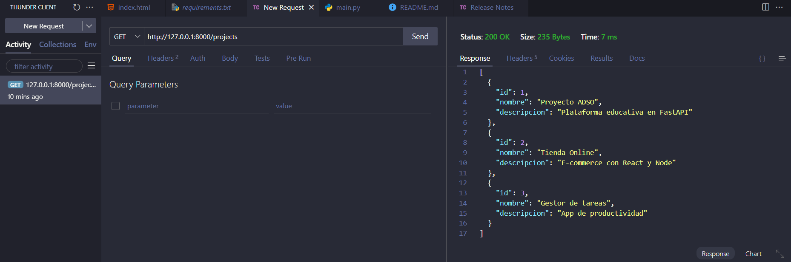

## ✅ Autor

- **Emmanuel Galeano Martínez**
- **Santiago Castaño Guerrero**
- **David Andres Herrera**

---

# 🌐 Consumo de API REST con FastAPI, Postman, Thunder Client y HTML/JavaScript

Este proyecto demuestra cómo consumir una API REST creada con **FastAPI**, utilizando tres métodos distintos:

1. 🧪 **Postman**
2. ⚡ **Thunder Client** (extensión de Visual Studio Code)
3. 🌍 **Una página web simple con HTML y JavaScript**

---

## 🚀 API Backend - FastAPI

Archivo: `main.py`

- Endpoint principal: `GET /projects`
- Devuelve una lista de proyectos simulados en formato JSON.
- Incluye configuración de CORS para permitir consumo desde navegador.

### ▶️ Para ejecutar el servidor:
```bash
uvicorn main:app --reload
```

---

## ⚙️ Instrucciones para consumir la API

### 🧪 Postman
Abrimos Postman.

Creamos una nueva petición de tipo GET.

- Ingresamos la siguiente URL:

http://127.0.0.1:8000/projects
Hacemos clic en el botón "Send".

- Visualizamos la respuesta en formato JSON.

---

### ⚡ Thunder Client (VS Code)
Abrimos Visual Studio Code.

- Accedemos a la pestaña de Thunder Client (extensión previamente instalada).

- Creamos una nueva petición de tipo GET.

- Escribimos la URL:

http://127.0.0.1:8000/projects
Pulsamos el botón "Send".

- Verificamos la respuesta JSON desde la pestaña de “Response”.

---

### 🌍 index.html (HTML + JavaScript)
Nos aseguramos de que la API esté ejecutándose localmente con el comando:

- uvicorn main:app --reload
- Abrimos el archivo index.html directamente en el navegador (doble clic o botón derecho → "Abrir con").
- O con live server lo abrimos de una forma mas facil

- El navegador hace automáticamente una solicitud GET a la siguiente URL:

http://127.0.0.1:8000/projects

- Si la API está en ejecución, la respuesta será mostrada en forma de lista (<ul>), con cada proyecto representado como un elemento.

- Si la API no está corriendo, no se mostrará nada en pantalla y aparecerá un error en la consola del navegador (F12 → pestaña “Consola”).

- El archivo usa fetch() para obtener los datos y mostrarlos dinámicamente en el HTML.

---

## 🧪 Pruebas de consumo de API

### 1. Postman


---

### 2. Thunder Client


---

### 3. Index.html


---

## 🌍 Página Web HTML + JS

Archivo: `index.html`

- Utiliza `fetch()` para consumir el endpoint y mostrar los proyectos en una lista `<ul>`.
- Carga directamente desde el navegador (no necesita servidor).

---

## 📦 Requisitos (opcional)

Archivo: `requirements.txt`

Puedes instalar las dependencias necesarias ejecutando:

```bash
pip install -r requirements.txt
```

---

## 📁 Estructura del proyecto

```
/Python FastAPI
│
├── main.py                # API con FastAPI
├── index.html             # Página web que consume la API
├── actividad.md           # Documentación del proceso
├── requirements.txt       # (Opcional) dependencias del proyecto
└── /capturas              # Evidencias en Postman y Thunder Client
    ├── postman.png
    └── thunderclient.png
```

---

## 📄 Párrafo de hallazgos:

Durante el desarrollo de esta actividad, nosotros como grupo comprendimos mejor cómo interactuar con una API REST utilizando diferentes herramientas.

🧪 Al usar Postman, logramos verificar de manera rápida las respuestas del servidor y visualizar los datos devueltos en formato JSON.

⚡ Con Thunder Client, aprovechamos su integración directa en Visual Studio Code para realizar pruebas de forma ágil sin salir del entorno de desarrollo.

🌐 Finalmente, al consumir la API desde una página web construida con HTML y JavaScript, entendimos claramente el flujo de comunicación entre el frontend y el backend.

🛡️ Decidimos agregar la configuración de CORS de forma opcional para permitir las peticiones desde el navegador, lo que nos ayudó a observar cómo el navegador restringe o permite solicitudes externas dependiendo de esta configuración.

✅ En general, esta actividad fortaleció nuestro entendimiento sobre el trabajo conjunto entre servidor, herramientas de prueba y cliente web.

---